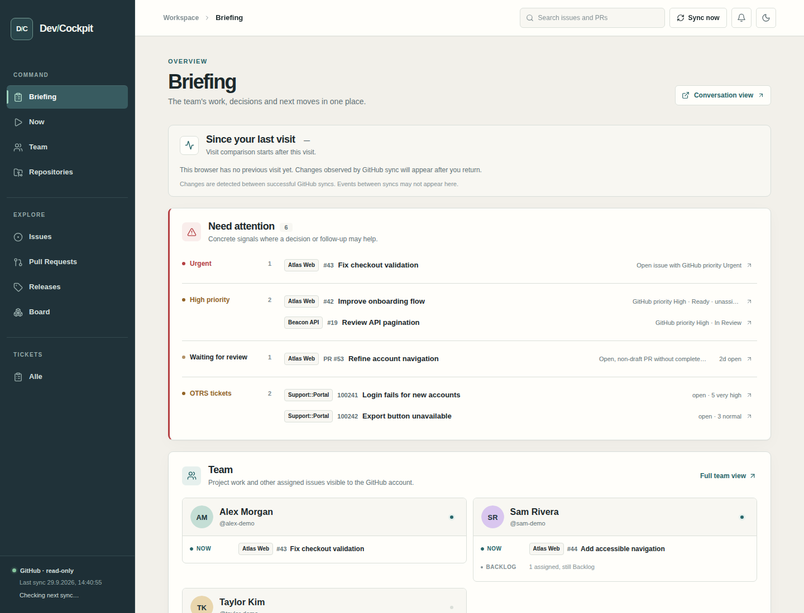
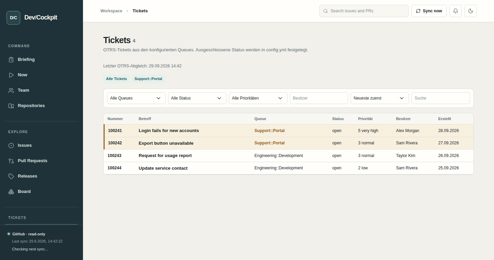

# DevCockpit

A local, read-only dashboard for a team's GitHub work. It brings Issues, Projects v2 status, pull requests, reviews, CI checks, and releases into one place. Optional OTRS 5 and Zabbix 7.4 integrations show tickets and application monitoring. DevCockpit does not edit these systems.


*Overview with fictional demo data.*

## What you can do

- See priorities, review requests, failing checks, and current team work across repositories.
- Open **My work** for your assignments, or switch to another configured team member.
- Search and filter issues, PRs, and optional tickets; read release notes on a timeline.
- Compare weekly issue, merge, release, and ticket activity in **Statistics**.
- Follow observed changes through the notification bell and a checklist since your last visit.
- Monitor optional Zabbix applications, including short incidents between syncs.

## What you need

- Python 3.10+ and `venv` on Linux
- Git and [GitHub CLI (`gh`)](https://cli.github.com/), signed in with an account that can read your repositories
- Read access to your GitHub Projects v2 if you want workflow status

No GitHub token or `.env` file is needed. OTRS and Zabbix are optional.

## Start on Linux

On Debian/Ubuntu, install the prerequisites with `sudo apt update && sudo apt install -y git python3 python3-venv gh`.

```bash
git clone https://github.com/vgarcia007/DevCockpit.git
cd DevCockpit
gh auth login
cp config.example.yml config.yml
# Edit config.yml: set your GitHub login and replace /example-org/my-app.
./start.sh
```

Open [http://127.0.0.1:7777](http://127.0.0.1:7777). The first sync runs in the background. `start.sh` creates a virtual environment and installs dependencies. Keep the terminal open; `Ctrl+C` stops the app. Run `./start.sh` again after changing `config.yml`; it restarts this checkout's app.

If you enabled OTRS or Zabbix, open **Settings → Accounts** and enter each account. The app verifies and saves it encrypted for future starts. GitHub works while those accounts are still missing.

## Configure GitHub

In your private `config.yml`, set:

| Setting | What to enter |
| --- | --- |
| `repositories[].url` | Each repository as `/owner/repo`. At least one is required. |
| `repositories[].name` | A unique name shown in DevCockpit. |
| `github.username` | Your GitHub login for My work and personal filters. |
| `repositories[].project_number` | The number at the end of a Projects v2 URL, or `null` if this repository has no Project. |
| `team[].project_number` | Optional user-owned Project number for this member; includes Draft Issues and counts all its tasks for that person. |

If you use Projects, make the `workflow.values` match your Project's **exact** Status option names. Set `priority.source` to `project` for a Project field or `issue_field` for an organization Issue Field, and set `priority.field` to its exact name. Open issues with **Urgent** or **High** appear in Need attention. Add people under `team` to show their work, including assigned issues in other accessible repositories. **My work** can switch to any configured team member. The supplied [`config.example.yml`](config.example.yml) contains these settings with one example repository.

If a Project is unavailable, GitHub may need the `read:project` scope: `gh auth refresh -s read:project`. DevCockpit shows sync errors in the UI.

### Optional personal Projects

Add `project_number` directly to the Project owner's entry under `team` in `config.yml`:

```yaml
team:
  - github: your-github-login
    name: Your Name
    project_number: 7
```

For `https://github.com/users/your-github-login/projects/7`, enter `7`. The `github` login on that same entry identifies the owner. Use the number from the URL, not a GraphQL ID such as `PVT_…`. Omit `project_number` or set it to `null` for members without a personal Project. Restart the app with `./start.sh` after changing the configuration.

Personal Projects use the same configured Status options and Priority field as your other Projects. Their issues and Draft Issues appear in Overview, Brief, Now, Team, My work, Issues/Board, Search, and Statistics. Every task counts for the configured member, including drafts without an assignee; Issues has a source filter for personal Projects.

Drafts display **Draft** and link to the GitHub Project. Moving a draft to the configured Done status completes it; moving it out of Done reopens it. Draft priorities always come from the Project field, even with `priority.source: issue_field`. Real issues retain their GitHub open/closed state. If an issue is already tracked through a configured repository, it appears once and its configured repository Project takes precedence for status and priority.

## Optional OTRS tickets

Remove the comment markers from the `otrs` example in `config.yml`, then enter your own HTTPS URL and queue IDs. After starting the app, open **Settings → Accounts** to enter and verify your agent login. `url` and `queue_ids` are required when OTRS is enabled. Tickets use a separate 15-minute sync and table.

Use `excluded_states` to hide closed statuses, `attention_queue_ids` for tickets shown under **Need attention** and in notifications, and `highlight_queue_ids` for emphasized table rows. These lists are empty unless configured. Set `otrs.enabled: false` to stop OTRS and delete its local cache on restart. Keep `config.yml` private.

To include a person's tickets in **My work**, Overview, Now, Team, and Brief, add `otrs_user` to their `team` entry. It must match the OTRS owner or responsible agent. Add yourself to `team` too if you want your own tickets there. Search shows ticket results separately when OTRS is enabled. With `otrs.enabled: false`, the GitHub views continue without ticket data.


*Optional OTRS view with fictional demo data.*

## Optional Zabbix monitoring

Add `zabbix` to your private `config.yml` (an example is in `config.example.yml`):

```yaml
zabbix:
  enabled: true
  url: https://monitoring.example.com/zabbix/
  interval_seconds: 60
  attention_min_severity: 0
  history_days: 30
  hosts:
    - host: app.example.com
      environment: prod
    - host: staging.example.com
      environment: preprod
```

Use the frontend URL including its installation path, and the exact technical host names from Zabbix. Your account needs API access to `host.get`, `trigger.get`, and `event.get`. Password login requires an account without Zabbix MFA. Sessions are logged out after each sync.

**Monitoring → Applications** shows hosts and problem history, including acknowledged and suppressed problems. By default, it shows open and resolved problems from the last 30 days, plus older problems that are still open. Short incidents between syncs are retrieved from Zabbix too. Filter by status, application, environment or severity, or search the problem list. Resolved problems show their end time and total duration. Set `history_days` (1–365, default 30) to change the history window; available history depends on Zabbix retention and your account permissions. **Need attention** includes only open problems from both environments at or above `attention_min_severity`: `0` Not classified, `1` Information, `2` Warning, `3` Average, `4` High, `5` Disaster. The default `0` includes everything.

Zabbix syncs independently every 60 seconds. Failed syncs keep the last successful data and display an error. Set `zabbix.enabled: false` or remove the section to disable it. Restart with `./start.sh` after config changes. Enter your Zabbix username and password under **Settings → Accounts**. Saved passwords are never displayed.

## Saved accounts

The app first checks that `gh` is installed and authenticated. Enabled OTRS and Zabbix integrations wait for an account under **Settings → Accounts**; GitHub continues to work. Each saved account is bound to its server URL, so changing the URL requires a matching account.

The app checks the connection before saving. Accounts survive restarts and can be changed or removed on the same page. Account changes wait for a running sync to finish and clear that integration's local cache. Disabling an integration keeps its saved account for later use.

Accounts are encrypted with AES-256-GCM in `~/.local/share/devcockpit/accounts.enc`. A random key is stored separately in `~/.config/devcockpit/account.key`. Directories are private (`0700`), files are readable only by your OS user (`0600`). No OS keyring or master password is required. Anyone who can read both files can decrypt the accounts; keep both private.

Older `user` and `password` config fields are removed on startup, without importing them. Enter the accounts again in the browser. Never add passwords to `config.yml`.

Back up both account files together. If the key is lost or storage is damaged, restore the matching pair. To reset accounts, stop the app, remove both files, restart, and enter accounts again. A missing key is never silently replaced while encrypted accounts exist.

## Good to know

- Statistics defaults to configured repositories with Projects. Switch to **All configured repositories** to include those without a Project. Optional OTRS queues contribute separate ticket counts. Counts use the latest synced creation, closure, merge, and release dates.
- GitHub syncs every 5 minutes by default. The sidebar shows the status and next sync for every enabled source; OTRS and Zabbix sync independently. New sync results show an **Updates available** hint. Choose **Show** to refresh the view while keeping its filters and scroll position.
- Dev-Cockpit also checks the tracked branch of its own checkout against the configured Git remote every five minutes. When the commit differs, a small **Neue Version verfügbar** link appears in the top bar and opens the repository.
- Need attention reflects the latest synced state: resolved conditions disappear after a successful sync and showing the updated view. Since your last visit is a separate history checklist; mark items done there without changing GitHub.
- The notification bell reports observed GitHub changes and changes in configured OTRS attention queues. Browser alerts are optional and work while the tab is open.
- DevCockpit has no user login and binds to localhost by default. Do not expose it without access control.
- `config.yml` and `instance/` are ignored by Git. The SQLite database is a local cache.

See the [configuration and feature guide](docs/guide.md) for Project mapping, permissions, views, and troubleshooting.

Run checks with `.venv/bin/python -m pytest -q`. The code is [CC0](LICENSE); vendored Lucide icons have their own [license](app/static/LUCIDE-LICENSE.txt).
